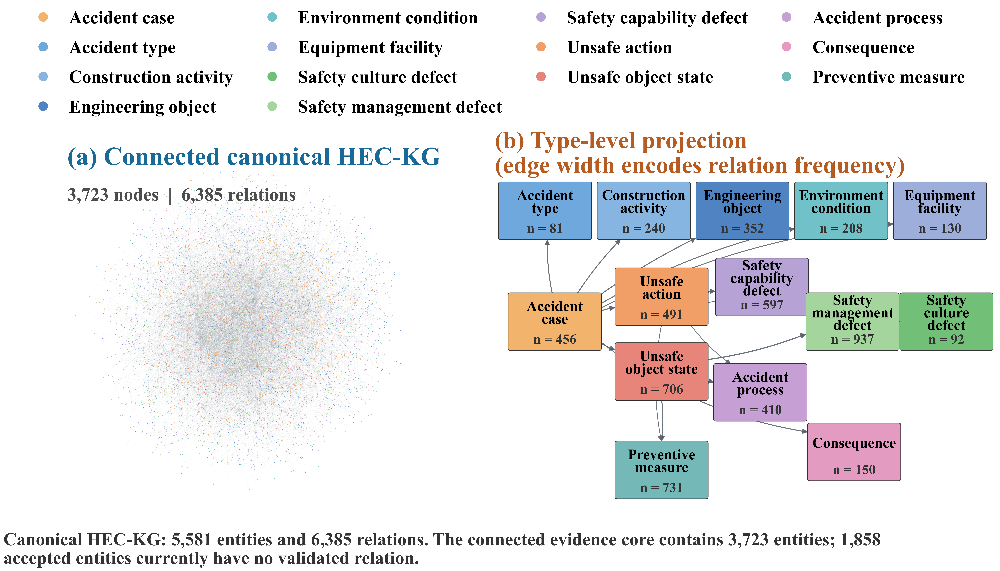
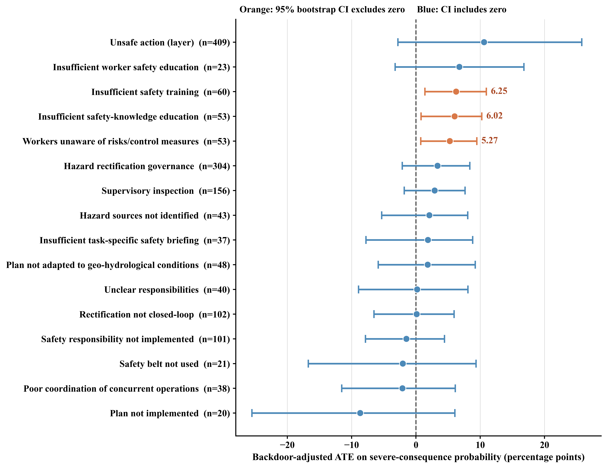

# 5 Results and discussion

This section reports the HEC-KG constructed using the best-performing configuration identified in Section 4, namely Causal-CoT with GPT-4o. We first examine graph scale, extraction consistency, computational cost, and knowledge-fusion outcomes. We then use a representative accident to illustrate evidence-grounded causal tracing, report the causal-effect estimates obtained from the 24Model-constrained DoWhy analysis, and translate the convergent graph and causal evidence into prevention priorities.

## 5.1 Construction results of HEC-KG

The complete pipeline processed all 456 anonymized HEC accident reports and retained one provenance-preserving `AccidentCase` node for each report. Before fusion, Causal-CoT extracted 6,617 entities and 8,061 relations, corresponding to 14.51 entities and 17.68 relations per case. Of the 456 case-level outputs, 454 passed all automated validation checks without a case-level review flag. The remaining two were retained with review metadata rather than silently discarded. The extraction stage required 18 h 35 min 39 s. Mean processing time was 146.80 s per case, with a median of 154.21 s and an interquartile range of 145.04–162.27 s. Including preprocessing, graph construction, fusion, causal-matrix generation, and export, the end-to-end experiment required 19 h 05 min 59 s.

Knowledge fusion reduced the graph to 5,581 canonical entities and 6,385 canonical relations. In total, 1,036 entity mentions were aligned with an existing canonical entity, reducing the entity count by 15.66%. Relation endpoint rewriting and duplicate aggregation removed 1,676 repeated relations, a reduction of 20.79%. The conservative fusion policy did not force ambiguous matches: 469 same-name but cross-type cases and 427 low-margin alignment candidates were recorded as conflicts for review. This behavior is important for 24Model because lexically similar expressions at the culture, management, capability, and direct-cause layers are not necessarily semantically interchangeable.

**Table 5. Scale, consistency, and efficiency of the constructed HEC-KG.**

| Aspect | Result |
|---|---:|
| Accident reports represented | 456 |
| Case outputs passing all automatic checks | 454 (99.56%) |
| Extracted entities before fusion | 6,617 |
| Extracted relations before fusion | 8,061 |
| Entities per case | 14.51 |
| Relations per case | 17.68 |
| Canonical entities after fusion | 5,581 |
| Canonical relations after fusion | 6,385 |
| Entity mentions merged | 1,036 (15.66%) |
| Duplicate relations consolidated | 1,676 (20.79%) |
| Conflicts retained for review | 896 |
| LLM extraction time | 18:35:39 |
| Mean / median time per case | 146.80 / 154.21 s |
| End-to-end pipeline time | 19:05:59 |

The voting records provide an additional view of extraction consistency. Among 9,447 question-level decisions, 9,296 (98.40%) were unanimous across the three inference runs, whereas 144 (1.52%) produced a 2:1 split. Seven decisions contained no valid ballot and were therefore not accepted without review. Overall, 6,098 positive decisions were admitted to downstream graph construction. The remaining case-context edges were deterministically materialized from validated entity provenance according to the ontology. These results indicate that most ontology-guided judgments were stable under repeated inference, while the retained vote traces expose the small subset for which model agreement was weaker.

Table 6 shows the composition of the canonical graph. Safety-management defects formed the largest causal class, followed by preventive measures, unsafe object states, and safety-capability defects. The relation distribution reflects the same hierarchy: `hasManagementCause` and `hasCapabilityCause` account for most causal links, while all 456 cases retain at least one direct-cause relation. Fusion was strongest for higher-level explanatory relations, reducing `hasCapabilityCause` and `hasCultureCause` by 45.64% and 44.44%, respectively. This pattern is expected because organizational causes are repeatedly expressed using near-synonymous formulations across reports.

**Table 6. Canonical entity and relation composition of HEC-KG.**

| Entity type | Canonical count | Entity type | Canonical count |
|---|---:|---|---:|
| AccidentCase | 456 | AccidentProcess | 410 |
| AccidentType | 81 | Consequence | 150 |
| ConstructionActivity | 240 | EngineeringObject | 352 |
| EnvironmentCondition | 208 | EquipmentFacility | 130 |
| SafetyCultureDefect | 92 | SafetyManagementDefect | 937 |
| SafetyCapabilityDefect | 597 | UnsafeAction | 491 |
| UnsafeObjectState | 706 | PreventiveMeasure | 731 |

| Relation type | Canonical count | Reduction after fusion |
|---|---:|---:|
| hasAccidentType | 336 | 0.00% |
| occursInActivity | 315 | 0.32% |
| involvesObject | 456 | 1.08% |
| hasEnvironmentCondition | 286 | 0.69% |
| involvesEquipment | 195 | 0.00% |
| hasConsequence | 386 | 1.78% |
| hasDirectCause | 817 | 0.00% |
| hasCapabilityCause | 986 | 45.64% |
| hasManagementCause | 1,783 | 24.42% |
| hasCultureCause | 95 | 44.44% |
| leadTo | 365 | 19.96% |
| controlledBy | 365 | 19.78% |

Figure 5 provides the missing global view of HEC-KG. The largest connected component contains 3,723 entities and all 6,385 canonical relations, linking every accident case to contextual, causal, evolutionary, consequence, or control information. A further 1,858 accepted causal or preventive entities currently have no validated relation and are therefore retained outside the connected evidence core instead of being connected through unsupported inference. The type-level projection reports the complete entity inventory and uses edge width to encode observed relation frequency.

## 5.2 Evidence-grounded case analysis

Figure 6 presents a representative subgraph for a temporary-structure collapse accident that caused one fatality and one minor injury. The immediate hazardous state was poor retaining-wall stability, which was linked to insufficient consideration of geological conditions, weak on-site supervision, incomplete hazard rectification, inadequate safety management, and ineffective safety training. The graph further connected inadequate management to three organizational conditions: schedule being prioritized over safety, insufficient safety investment, and weak safety-accountability culture. The direct state led to retaining-wall collapse and worker fall, while implementation of the safety-production responsibility system was linked as a preventive measure. Every displayed causal judgment received a 3:0 vote and passed ontology-direction and evidence-presence validation.

The case illustrates the analytical gain obtained from the 24Model hierarchy. A flat extraction would identify defective retaining-wall conditions and the collapse event, but it would not preserve the explanatory path from organizational priorities and resource allocation to management execution and the direct hazardous state. HEC-KG keeps these levels distinct and attaches the supporting report span to each node or relation. Consequently, a Neo4j query can move from the observed failure to its upstream management and culture factors, or from a factor to the associated controls and source cases. The subgraph should be interpreted as a structured representation of the investigation report, rather than independent proof that every upstream factor caused the event.

## 5.3 Causal-effect estimates for severe consequences

### 5.3.1 Estimability and sample support

The causal matrix contained 456 rows, of which 423 (92.76%) were classified as severe-consequence cases. The corrected provenance mapping yielded non-zero support across all modeled 24Model and context layers: 449 cases contained a safety-management defect, 416 a safety-capability defect, 161 a safety-culture defect, 409 an unsafe action, 440 an unsafe object state, 92 an accident type, 221 a construction activity, and 190 an environmental condition. This confirms that the causal matrix represents the intended multilevel graph rather than only the direct-cause layer.

Twenty candidate treatments met the initial frequency ranking. Sixteen satisfied the overlap and outcome-cell requirements and were estimated, while four were excluded. The layer indicators for safety-management defects and unsafe object states left only seven and sixteen controls, respectively, below the minimum group size of twenty. Weak safety inspection and the presence of a special construction plan were also excluded because all treated cases had severe outcomes, producing an empty treated non-severe cell. These exclusions prevent near-universal or completely separated factors from yielding unstable coefficients that appear precise only because of limited comparison data.

### 5.3.2 Adjusted effects and dominant causal pathway

Figure 7 reports the backdoor-adjusted average treatment effects (ATEs) and percentile-bootstrap 95% confidence intervals for the sixteen estimable factors. Three effects were positive with intervals excluding zero. Insufficient safety training produced the largest supported estimate. Its presence was associated with a 6.25-percentage-point increase in the probability of a severe consequence among recorded accidents (95% CI: 1.40–10.95, p = 0.0095). Insufficient safety-knowledge education increased the probability by 6.02 percentage points (95% CI: 0.80–10.24, p = 0.0067), while workers' lack of knowledge about risks and control measures increased it by 5.27 percentage points (95% CI: 0.75–9.48, p = 0.0184).

**Table 7. Accident factors with supported positive effects on severe consequences.**

| Accident factor | Support | Treated severe rate | Control severe rate | Unadjusted RD | Adjusted ATE | 95% CI | p-value |
|---|---:|---:|---:|---:|---:|---:|---:|
| Insufficient safety training | 60 | 98.33% | 91.92% | 6.41 pp | 6.25 pp | [1.40, 10.95] pp | 0.0095 |
| Insufficient safety-knowledge education | 53 | 98.11% | 92.06% | 6.05 pp | 6.02 pp | [0.80, 10.24] pp | 0.0067 |
| Workers unaware of risks and control measures | 53 | 98.11% | 92.06% | 6.05 pp | 5.27 pp | [0.75, 9.48] pp | 0.0184 |

The three estimates form a coherent training–knowledge–risk-communication cluster. Under the 24Model ordering, insufficient organizational training and safety-knowledge education constrain workers' safety capability, which weakens hazard recognition and control selection, increases the opportunity for unsafe action or failure to respond to an unsafe object state, and ultimately raises accident severity. Thus, the most strongly supported pathway is

\[
\text{Safety-management defect}
\rightarrow \text{Safety-capability limitation}
\rightarrow \text{Unsafe action or unmitigated object state}
\rightarrow \text{Severe consequence}.
\]

The ATEs in Table 7 were estimated separately and must not be added to produce a joint effect. Their semantic proximity and partial case overlap instead indicate a recurrent mechanism in which weak training, inadequate knowledge transfer, and poor risk communication co-occur. A composite intervention would require a separately defined treatment and sufficient cases representing all treatment combinations.

The unsafe-action layer had a larger point estimate of 10.60 percentage points, but its 95% confidence interval ranged from -2.79 to 25.80 percentage points (p = 0.160). The uncertainty arises because unsafe actions occurred in 409 of 456 cases, leaving a much smaller comparison group. Similarly, hazard-rectification governance and supervisory inspection had positive point estimates of 3.36 and 2.92 percentage points, respectively, but their intervals included zero. Negative point estimates for factors such as failure to implement a plan or failure to use a safety belt also had wide intervals spanning zero and should not be interpreted as protective effects.

### 5.3.3 Refutation and scope of inference

Each of the sixteen estimates was subjected to random-common-cause and placebo-treatment refutation. Adding a random common cause changed the estimated ATE by 0.00012 on average, with a maximum absolute change of 0.00037. After treatment permutation, the mean absolute placebo effect was 0.00170 and the maximum was 0.00534. None of the 32 refutation records triggered the predefined review rule. These diagnostics show numerical stability under the specified perturbations, but they do not establish the absence of unmeasured confounding.

The estimand concerns severity conditional on an accident having been recorded. The corpus contains no accident-free construction observations, and severe cases account for 92.76% of the sample. The estimates therefore quantify adjusted differences in severe-consequence probability among reported accidents. They do not estimate how a factor changes the probability that an accident occurs. This distinction also explains why high-frequency factors can have broad operational importance while remaining difficult to estimate causally because they provide little untreated comparison data.

## 5.4 Prevention priorities and practical implications

The joint evidence supports a tiered prevention strategy. The first priority is competency-based safety training and risk communication. This priority is supported by all three positive ATEs and by the graph, in which the most frequent explicit controls include strengthening safety education, safety awareness, and safety-knowledge education. Training should therefore be evaluated through demonstrated hazard recognition, control selection, and task-specific response rather than attendance records alone. A pre-task briefing can be closed with a short worker confirmation of the relevant hazards, stop-work conditions, and required controls.

The second priority is closed-loop supervision and hazard rectification. Hazard-rectification governance and supervisory inspection covered 304 and 156 cases in the causal matrix, respectively, and the case study showed how weak supervision and unresolved hazards connected an unstable engineering object to deeper management failure. Their adjusted intervals included zero, so this priority is based on graph prevalence and mechanism consistency rather than a confirmed non-zero ATE. In practice, each identified hazard should be assigned an owner, deadline, verification record, and closure state, allowing the corresponding Neo4j path to support audits across projects and accident types.

The third priority is engineering-condition control for high-consequence activities. Unsafe object states appeared in 440 cases and could not be estimated as a layer-level treatment because only sixteen control cases remained. Its prevalence nevertheless indicates that technical reviews, support adequacy, drainage, equipment condition, and environmental monitoring should be verified before work starts and after material changes in geology, water conditions, loading, or construction sequence. The representative case further shows that technical controls are weakened when schedule pressure, insufficient investment, and unclear accountability remain unresolved.

**Table 8. Evidence-linked prevention priorities.**

| Priority | Target mechanism | Evidence basis | Recommended implementation |
|---|---|---|---|
| 1 | Training, safety knowledge, and risk communication | Three positive adjusted ATEs: 6.25, 6.02, and 5.27 pp | Scenario-based training, task-specific hazard briefing, and worker verification of hazards, controls, and stop-work conditions |
| 2 | Supervision and closed-loop hazard rectification | Broad graph coverage, 304 hazard-governance and 156 supervision cases, and the representative-case path | Assign hazard owner and deadline, record correction evidence, conduct independent closure verification, and escalate overdue hazards |
| 3 | Unsafe object-state and engineering-condition control | Unsafe object states in 440 cases and a direct technical mechanism in the case study | Conduct pre-work technical review, support and drainage checks, equipment inspection, and dynamic monitoring after condition changes |
| 4 | Organizational accountability and resource commitment | Culture-to-management paths in HEC-KG | Link safety responsibilities to named roles, decision records, resource allocation, and stop-work authority |

These priorities illustrate how HEC-KG and causal-effect estimation serve different but complementary functions. The graph identifies recurring factors, multilevel paths, evidence, and candidate controls. Causal analysis tests whether selected factors retain an association with severity after theory-guided adjustment and sample-quality filtering. Used together, they support traceable intervention planning without treating graph frequency as causal strength or treating an observational ATE as a guaranteed policy effect.
